# RESTful Booker API Performance Testing Using Apache JMeter
This repository showcases performance testing of the RESTful Booker API using Apache JMeter. The goal was to evaluate responsiveness, scalability, and reliability under varying user loads using tests such as stress, spike, and endurance testing.
## Introduction
The RESTful Booker API was tested to assess its responsiveness, scalability, and reliability under varying loads. The results identify bottlenecks and provide optimization recommendations.

## Setup and Usage
1. Clone this repository:
   ```bash
   git clone https://github.com/DM9933/RESTful-Booker-API-Performance-Testing-Using-Apache-JMeter.git

## API Documentation
The API documentation, including details on endpoints like authentication, booking operations, and health checks, can be found [here](https://restful-booker.herokuapp.com/apidoc/index.html#api-Auth).

## Features
- Simulated concurrent users from 100 to 800.
- Assessed multiple endpoints:

- **Authentication**:
   -  `POST /auth` (createToken)  
     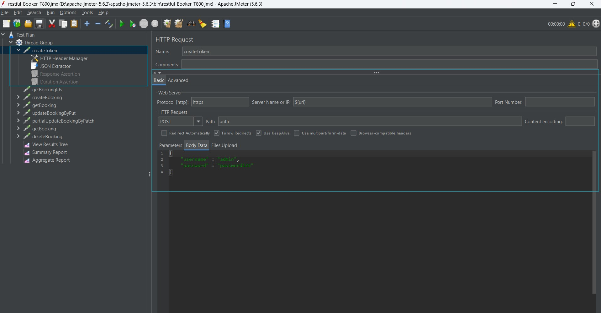
   -  `POST /auth` (createTokenResponse)  
     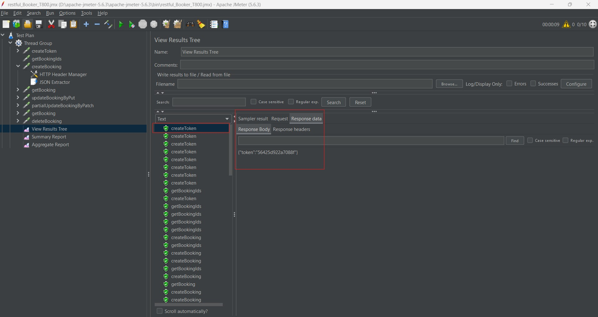

- **Booking Operations**:
  - `POST /booking` (createBooking)  
    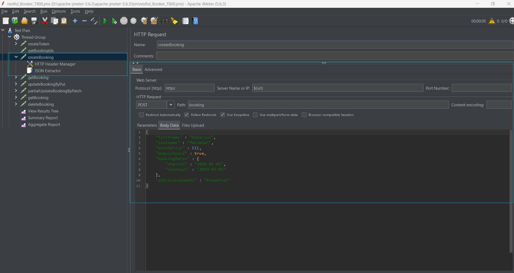
  - `POST /booking` (createBookingResponse) 
    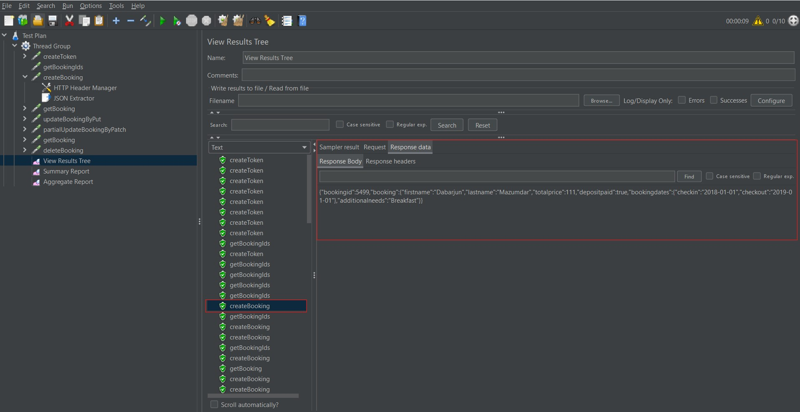
  - `GET /booking` (getBookingIds)  
    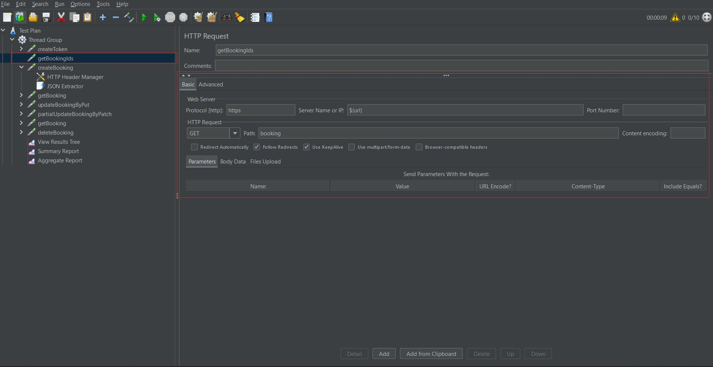
  - `GET /booking` (getBookingIdsResponse)
    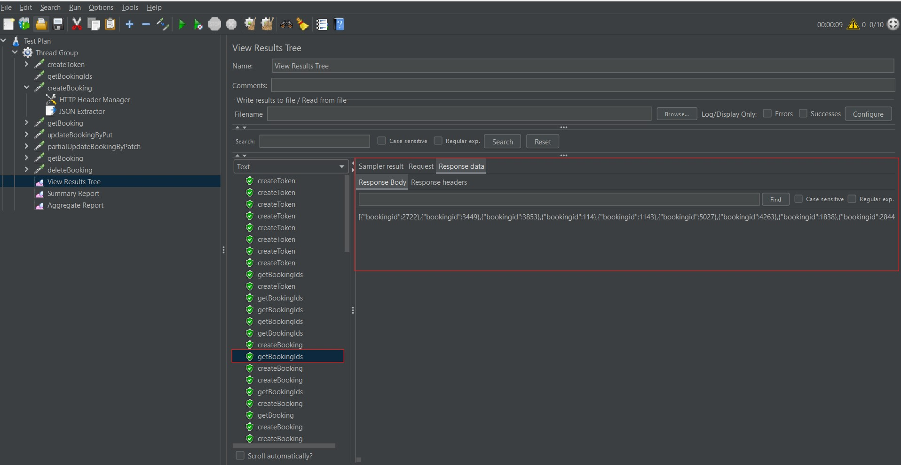
  - `GET /booking/:id` (getBooking)  
    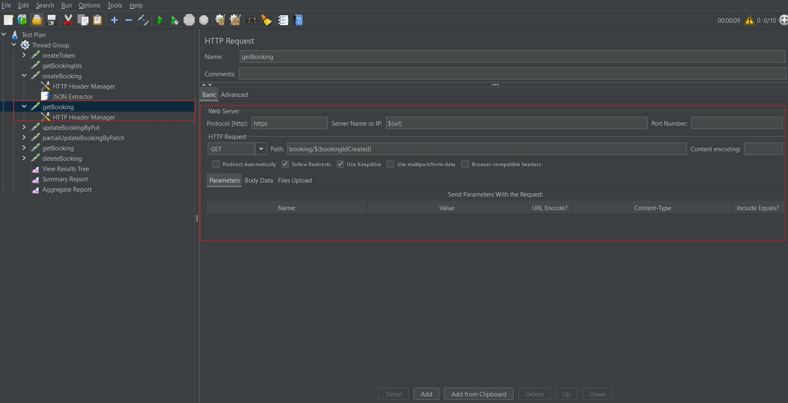
  - `GET /booking/:id` (getBookingResponse) 
    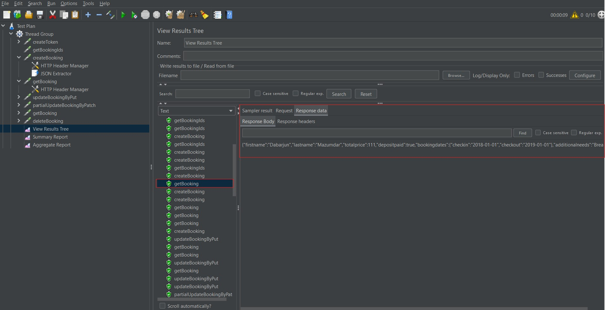
  - `PUT /booking/:id` (updateBookingByPut)  
    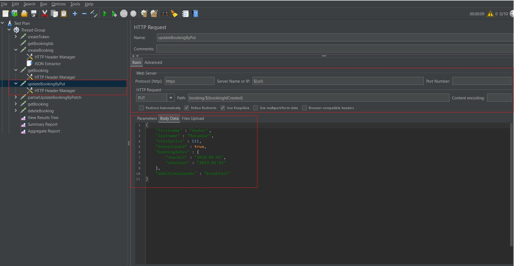
  - `PUT /booking/:id` (updateBookingByPutResponse)  
    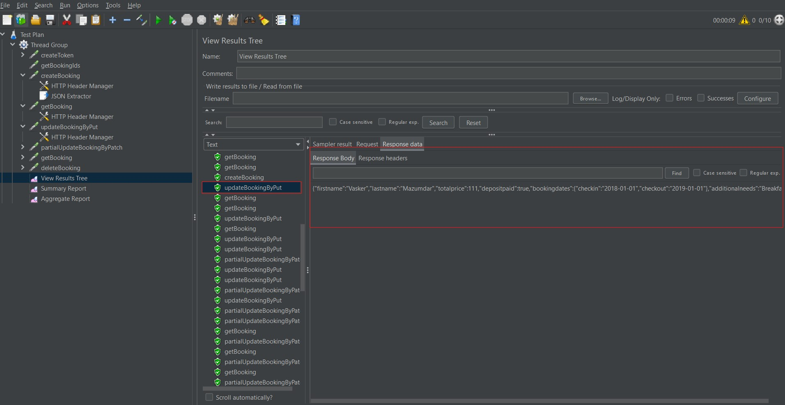
  - `PATCH /booking/:id` (partialUpdateBooking)  
    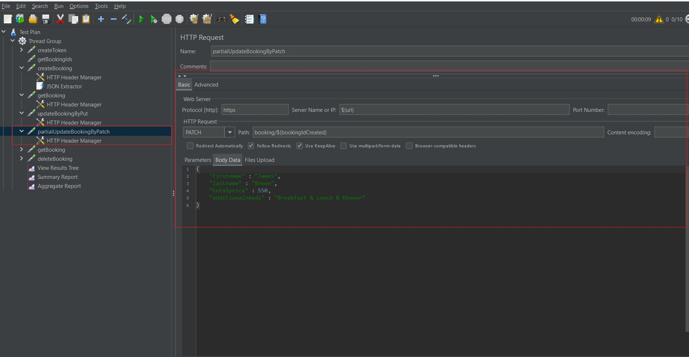
  - `PATCH /booking/:id` (partialUpdateBookingResponse)  
    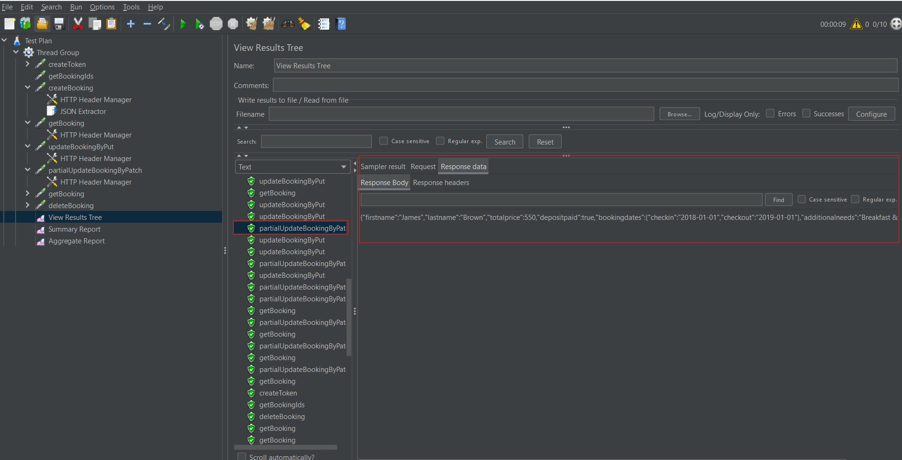
  - `DELETE /booking/:id` (deleteBooking)  
    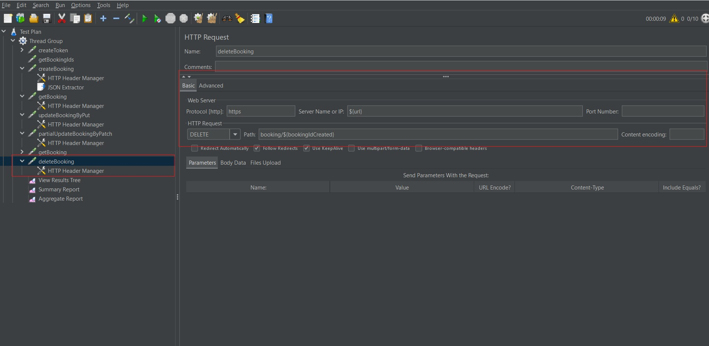
  - `DELETE /booking/:id` (deleteBookingResponse)  
    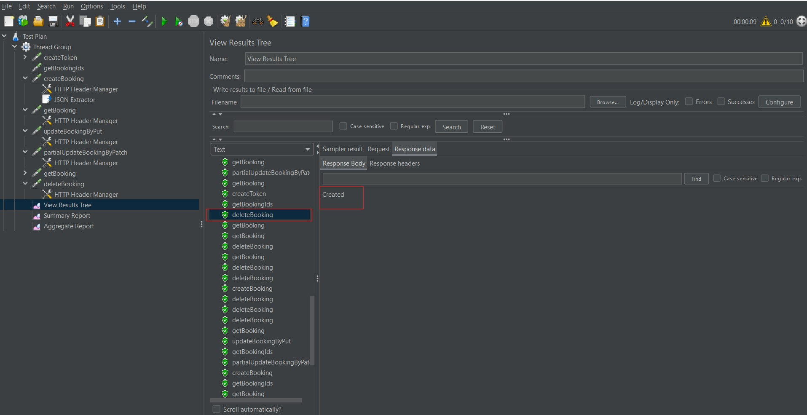
    
- **Measured metrics:**
  - Application Performance Index (APDEX)
  - Response times (min, avg, max, 90th percentile)
  - Throughput (requests/sec)
  - Error rates

## Test Results Summary
### 1. Application Performance Index (APDEX)
The **APDEX** score represents user satisfaction, calculated based on response time thresholds.
| Users | Total APDEX | APDEX (createToken) | APDEX (getBookingIds) | APDEX (Other Endpoints) |
|-------|-------------|---------------------|-----------------------|------------------------|
| 100   | 0.934       | 0.475               | 1.000                 | 1.000                  |
| 200   | 0.867       | 0.458               | 0.480                 | 1.000                  |
| 300   | 0.932       | 0.458               | 0.997                 | 1.000                  |
| 400   | 0.840       | 0.223               | 0.499                 | 1.000                  |
| 500   | 0.812       | 0.056               | 0.455                 | ~1.000                 |
| 600   | 0.777       | 0.029               | 0.267                 | ~0.995                 |
| 700   | 0.841       | 0.029               | 0.729                 | ~0.991                 |
| 800   | 0.830       | 0.025               | 0.685                 | ~0.989                 |

**Observations**:
- The `createToken` and `getBookingIds` endpoints experienced significant APDEX degradation at higher loads.
- Other endpoints maintained high APDEX scores (~1.000).

### 2. Response Times (ms)
| Users | Avg Response Time | 90th Percentile | Max Response Time | Error Rate |
|-------|-------------------|-----------------|-------------------|------------|
| 100   | 402.42            | 1141.90         | 1773.00           | 0.00%      |
| 200   | 499.91            | 1162.00         | 4007.00           | 0.00%      |
| 300   | 422.22            | 1165.00         | 3873.00           | 0.00%      |
| 400   | 551.80            | 1340.90         | 9878.00           | 0.00%      |
| 500   | 896.76            | 2366.30         | 14575.00          | 0.00%      |
| 600   | 1209.65           | 3185.20         | 20163.00          | 0.33%      |
| 700   | 1147.55           | 3179.70         | 22231.00          | 0.14%      |
| 800   | 1280.42           | 3550.00         | 24500.00          | 0.16%      |

**Observations**:
- Response times increased steadily with user load, peaking at 1280 ms for 800 users.
- Significant response time variability at 600+ users, especially for `createToken` and `getBookingIds`.
- Errors emerged starting from 600 users, with a marginal increase in error rates at higher loads.

### 3. Endpoint-Wise Performance
| Endpoint              | Avg. Response Time (ms) | Errors | Observations                                      |
|-----------------------|-------------------------|--------|---------------------------------------------------|
| createToken           | 4316.92                 | 4      | Major bottleneck; high latency and errors.       |
| createBooking         | 323.67                  | 0      | Consistent performance across all tests.         |
| getBooking            | 322.95                  | 0      | Stable and reliable under load.                  |
| getBookingIds         | 1502.03                 | 0      | Increased latency under high load.               |
| updateBookingByPut    | 324.54                  | 4      | Minimal errors, stable latency.                  |
| partialUpdateBooking  | 339.34                  | 4      | Slight performance dips at high loads.           |
| deleteBooking         | 314.24                  | 4      | Consistent performance.                          |

### 4. Load Testing Result
| Users | Avg. Response Time (ms) | 90th Percentile (ms) | Max Response Time (ms) | Error Rate |
|-----------|-----------------------------|--------------------------|----------------------------|----------------|
| 100   | 402.42                      | 1141.90                 | 1773.00                    | 0.00%          |
| 400   | 551.80                      | 1340.90                 | 9878.00                    | 0.00%          |
| 800   | 1280.42                     | 3550.00                 | 24500.00                   | 0.16%          |

## Errors
#### Error Types:
- **403 Forbidden Errors**: 75% of errors observed, primarily affecting `createToken` and `getBookingIds`.
- **Connection Reset Errors**: Sporadic (25%), linked to backend resource exhaustion.
#### Top Causes:
- Backend resource bottlenecks, especially under heavy loads.
- Inefficient token generation in the `createToken` endpoint.

## Recommendations
**1. Optimize `createToken`**
- Review and optimize backend token generation logic.
- Explore lightweight encryption or caching mechanisms for tokens.
  
**2. Implement Load Balancing**
- Deploy load balancers to evenly distribute traffic across servers.
  
**3. Improve Error Handling**
- Mitigate 403 Forbidden and Connection Reset errors through better server-side logic and retry mechanisms.
  
**4. Scalability Enhancements**
- Increase server resources (CPU, memory, and bandwidth).
- Employ autoscaling for dynamic user load handling.
  
**5. Introduce Caching**
- Cache responses for static/semi-static endpoints like `getBookingIds` to reduce server strain.
  
**6. Conduct Stress Testing**
- Identify the API's breaking point under extreme loads.
- Plan for high-availability solutions.

## Conclusions
- The system performs well under **400 users**, with no errors and manageable response times.
- At **800 users**, performance degradation is evident, with increased response times and the appearance of errors.
- These results suggest that the system's capacity threshold lies somewhere between 400 and 800 users. Further optimization or resource scaling may be necessary to handle higher loads effectively.
---

## Prerequisites
- **Apache JMeter** (v5.5 or above)
- **Java** (v8 or above)
- **System with 4+ cores and 16GB RAM** (recommended)
- **BlazeMeter Chrome Extension** (optional for generating JMX files)
  
## Installation
### Step 1: Install Java
1. Download and install Java from [Oracle's official website](https://www.oracle.com/java/technologies/javase-jdk11-downloads.html).
### Step 2: Install Apache JMeter
1. Download JMeter binaries from the [official website](https://jmeter.apache.org/download_jmeter.cgi).
2. Extract the `apache-jmeter-5.x.zip` file.

## How to Run Performance Tests
### Step 1: Set Up JMeter Test Plan
1. Open Apache JMeter GUI.
2. Create a new Test Plan.
3. Add Thread Groups to simulate users.
4. Add HTTP Samplers for each API endpoint.
5. Configure Listeners for monitoring (e.g., Summary Report, Aggregate Report).
#### Test Plan Setup


### Step 2: Configure Thread Group
1. Right-click on Test Plan → Add → Threads (Users) → Thread Group.
2. Set parameters:
   - Number of Threads (Users): 100, 200, 300...
   - Ramp-Up Period: 10 seconds.
   - Loop Count: 1.
#### Thread Group Configuration
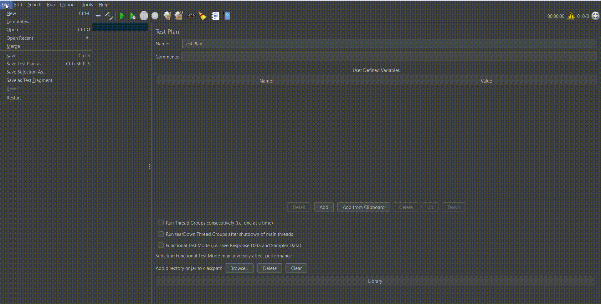

### Step 3: Add HTTP Requests
1. Right-click on Thread Group → Add → Sampler → HTTP Request.
2. Configure HTTP Request:
   - Server Name/IP: `restful-booker.herokuapp.com`
   - Path: Corresponding API endpoint (e.g., `/auth`, `/booking`).
#### HTTP Request Configuration


### Step 4: Add Listeners
1. Right-click on Thread Group → Add → Listener → Summary Report.
2. (Optional) Add more listeners like Aggregate Report, View Results Tree.
#### Listener Configuration


### Step 5: Load Test Execution
1. Save the test plan (e.g., `Restful_Booker_Test_Plan.jmx`).
2. Run the test in GUI mode:
   - Click the green **Start** button.
     
## Generating Reports
### 1. Generate CSV Files:
   ```bash
   jmeter -n -t Restful_Booker_Test_Plan.jmx -l Results.csv
   ```
### 2. Generate HTML Report:
   ```bash
   jmeter -g Results.jtl -o Report_Folder
   ```
## Reports

